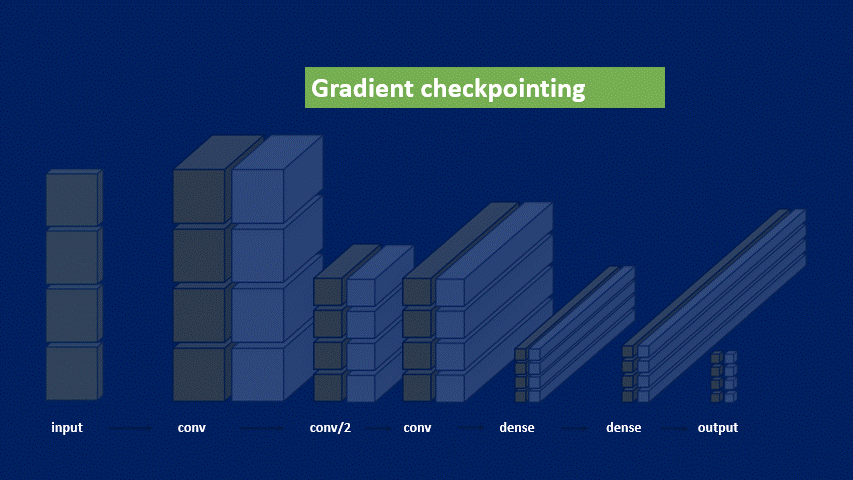

# lightstream

Lightstream is a Pytorch library to train CNN's with large input images. Parsing large inputs is achieved through a combination of 
gradient checkpointing and tiling the input image. For a full overview of the streaming algorithm, please read the article:

[1] H. Pinckaers, B. van Ginneken and G. Litjens, "Streaming convolutional neural networks for end-to-end learning with multi-megapixel images," in IEEE Transactions on Pattern Analysis and Machine Intelligence, [doi: 10.1109/TPAMI.2020.3019563](https://ieeexplore.ieee.org/abstract/document/9178453)




## Installation
The lightstream repository can be installed using pip, or you can alternatively clone the git repository and build the wheel.

```python
pip install lightstream
```

We also recommend to install the albumentationsxl package, which is an albumentations fork with a pyvips backend to preprocess large images

```python
pip install albumentationsxl
```

## Documentation
The documentation can be found at https://diagnijmegen.github.io/lightstream/

Alternatively the documentation can be generated locally using 

```
make docs
```


## 